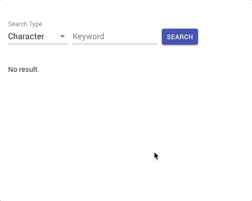

# Ani Search (FE Coding Assignments)

## Expected Result Example



## Features

- Search character by keyword, show character name and image from search result
- Search staff by keyword, show staff name and photo from search result

Please implement above feature with

- React.js (Next.js) and Hook
- Material-UI
- GraphQL (Apollo GraphQL)

### Improvements

- No matched result handling
- Error handling
- and any improvements you want to do...

## Development

```bash
$ yarn install --frozen-lockfile
$ yarn dev
```

## GraphQL API Document

- [anilist GraphiQL](https://anilist.co/graphiql)

  - Character
  - Staff

- [API docs](https://anilist.gitbook.io/anilist-apiv2-docs/)

## Material-UI component you may want to use

- Box
- Button
- CircularProgress
- Container
- FormControl
- InputLabel
- MenuItem
- Select
- TextField
- and any components you want to use...

[Material-UI](https://material-ui.com/)

## Contact

If you have any problems, please contact hau.chen@mediatek.com or open an issue.
